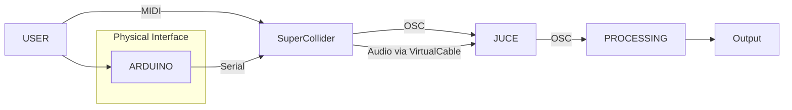

  

<h1 align="center">T.I.L.E.S</h1>

 TANGIBLE INTERFACE FOR LAYERED SOUND ELECTRONICS

### Description
Employing Supercollider as a sound source, we design an interface that enables analogue audio processing using Arduino as the communication protocol. We manipulate the audio through JUCE plugins for effects and utilise processing as the graphical user interface for visualisation.

### Motivation
The objective of this project is to provide individuals with disabilities with an immersive experience of sound processing through an analogue interface. Utilising pins, we create braille indents on our ‘tiles’, enabling the user to freely explore and manipulate the interface.

### Schematic Diagram

### Table of Contents:
* Requirements
* Software Components
* Scope for Future Work
* Acknowledgement
* Contributors

### Requirements: 
#### Hardware:
* Cardboard
* Copper Proto board
* LEDs (Different Voltages)
* Diodes (1N4007)
* Cables
* Rotatory Potentiometers (10kΩ)
* Slider Potentiometers (10kΩ)
* Jack Connectors
* Lego Pieces/Styrofoam for the “TILES”

#### Software:
* Supercollider: (https://supercollider.github.io/)
* JUCE Framework: (https://juce.com/)
* Projucer (For plugin setup and export)
* Arduino IDE: (https://www.arduino.cc/)
* Virtual Audio Cable Software (eg. BlackHole for macOS, VB-Audio Virtual Cable for Windows)

